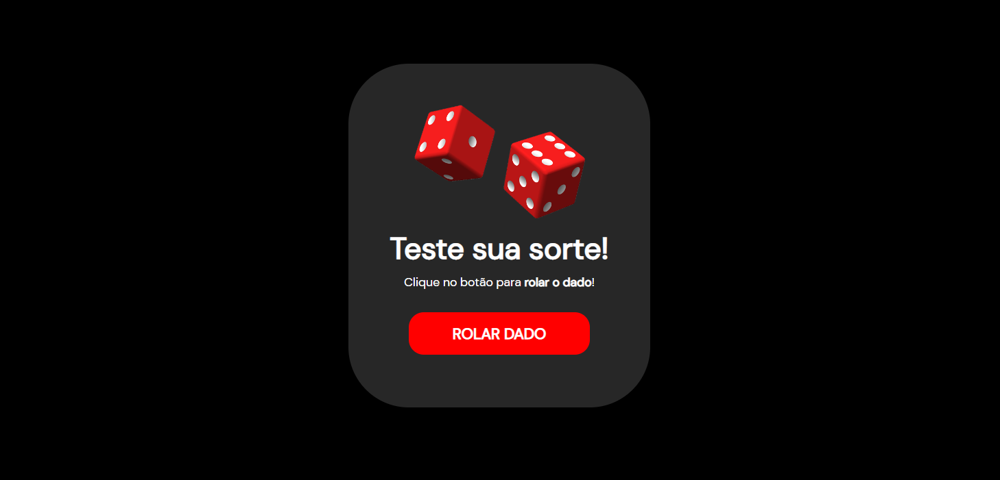

# Roll the dice 🎲

> <a href="https://lucyanovidio.github.io/roll-the-dice">Acesse aqui</a>

## 💻 Sobre

Roll the dice (role o dado) é um projeto que desenvolvi a partir do conteúdo aprendido na Maratona Explorer 1, evento da <a href="https://rocketseat.com.br">Rocketseat</a>,
onde, entre outras coisas, vimos:
+ Conceitos básicos de HTML e CSS;
+ DOM;
+ Geração de número aleatório para resultado final.

*<a href="https://github.com/lucyanovidio/maratonas-explorer-rocketseat/tree/main/maratona-explorer-1">Acessar repositório da Maratona Explorer 1</a>*

 
No pequeno programa Roll the dice, ao clicar em "rolar dado", ele te retorna um número aleatório de 0 a 6, números existentes em um dado, com uma imagem da respectiva face do mesmo.
Ao fim, o usuário pode voltar ao início ou rolar o dado novamente.
  

> <a href="https://lucyanovidio.github.io/roll-the-dice">Teste sua sorte 🍀</a>

## 🧠 Tecnologias

    
    
    

 

---

<table>
  <tr>
    <td>
      
    </td>
    <td>
      Feito por <a href="https://github.com/lucyanovidio">Lucyan Ovídio.</a> 🙋🏿‍♂️
    </td>
  </tr>
</table>
